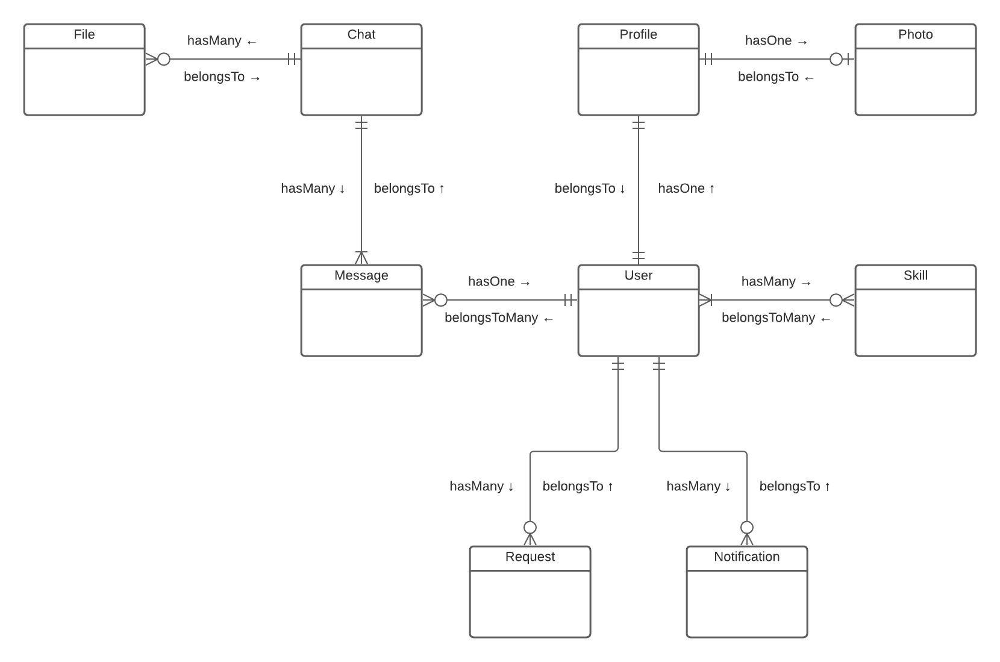

# Entity Relationship Diagram

[Edit the diagram](https://lucid.app/lucidspark/1cde8d89-6984-41ec-8276-aaa035333e14/edit#)

The ERD describes the database structure and relations between tables (models). It's built using both Crow's Foot Notation and Sequelize method names to make it easier to understand it in the code context.
